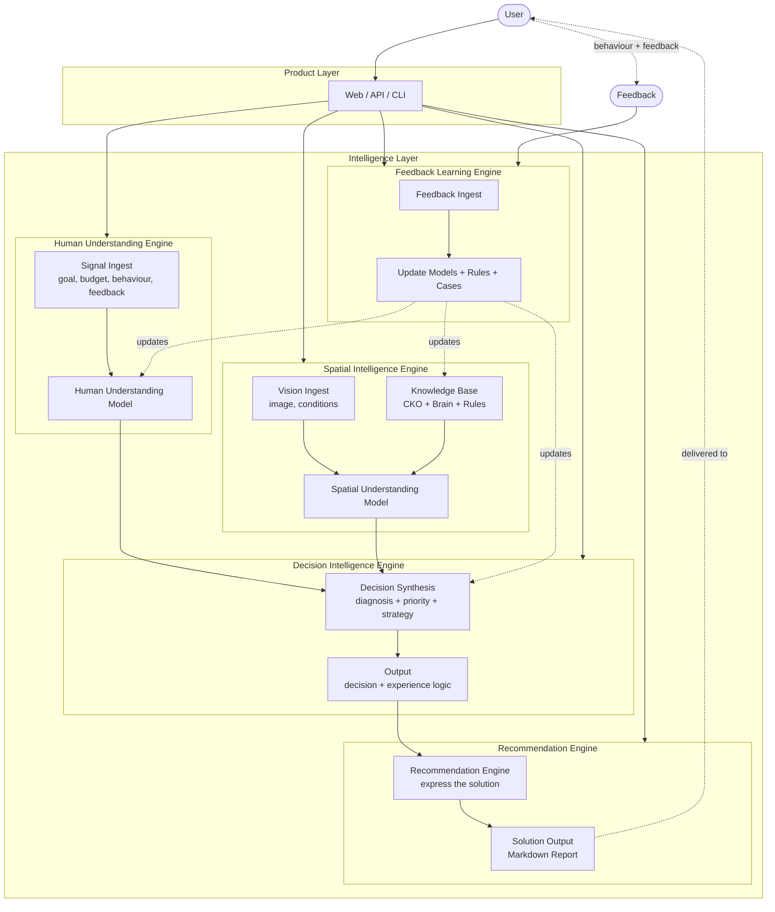

# CaseOS Intelligence Architecture V2

- **Date:** 2026-07-31
- **Status:** Blueprint (informative; not yet an ADR)
- **Supersedes:** `Architecture.md` ASCII sketch (the seven-step "Input -> Vision AI -> Case Schema -> Database -> Vector Search -> LLM -> Proposal -> PDF" diagram from the V1 playground-only product)
- **Authoritative sources:** the ADRs in this folder (ADR-005 .. ADR-013). This document is the **map**, the ADRs are the **ground**.
- **Source of truth:** `docs/architecture/CaseOS_Intelligence_Architecture_V2.md`

---

## 1. Core Architecture Principle

CaseOS V2 redefines the system around **six intelligence components**:

```
   Human Understanding Engine
              +
   Spatial Intelligence Engine
              |
              v
   Decision Intelligence Engine
              |
              v
   Trust Model
              |
              v
   Recommendation Engine
              |
              v
   (delivered)
              |
              v
   Feedback Learning Loop
              |
              +---- updates ----+
              |        |        |
              v        v        v
          Human    Knowledge   Decision
          Context  Library     Rules
```

**Code is replaceable. Brain is cumulative.** Every layer below must expose
**Input / Processing / Output / Consumer**. An intelligence layer that has no
consumer is a documentation ghost; the AR-001 review already identified five
of those and they will not be allowed to reoccur.

### The six components

| Component | Question it answers |
| --- | --- |
| Human Understanding Engine | "What does this person really want?" |
| Spatial Intelligence Engine | "What does this space need?" |
| Decision Intelligence Engine | "What should we do?" |
| Trust Model | "Why should we trust this decision?" |
| Recommendation Engine | "How should we express the solution?" |
| Feedback Learning Loop | (closes the loop; updates every component above) |

The first five are linear in the user journey; the sixth is an arrow back
to them. Feedback Learning Loop does not answer a question; it **closes the loop**
that lets every other engine improve.
---

## 2. The Six-Component Intelligence Model

Each component below is a **layer** with Input / Processing / Output / Consumer.
Cross-cutting ADRs that introduce these layers:

- Human Understanding Engine        ADR-013 (foundation)
- Spatial Intelligence Engine       in scope of V2 Blueprint; informed by ADR-008 / ADR-009 / ADR-010 / ADR-011 / ADR-012
- Decision Intelligence Engine      ADR-014 (judgment model)
- Trust Model                       ADR-016 (qualification)
- Recommendation Engine            ADR-017 (how to communicate)
- Feedback Learning Loop            ADR-018 (closes the loop)

### 2.1 Human Understanding Engine

**Purpose:** Understand the human behind the project.

**Input:**
- project goals
- explicit requirements
- budget
- constraints
- browsing behavior
- case preferences
- natural-language feedback

**Processing:** signal ingestion -> dimension tagging -> Human Understanding Model.

**Output:** Human Understanding Model.

**Consumer:** Decision Intelligence Engine, Recommendation Engine, Feedback Learning Loop.

**Authority:** ADR-013 (Proposed).

---

### 2.2 Spatial Intelligence Engine

**Purpose:** Understand the physical world.

**Input:**
- site images
- space conditions
- architecture relationship
- environment
- existing facilities

**Knowledge base:**
- CKO (Case Knowledge Object) -- ADR-011
- Golden Case selection -- ADR-012
- Decision Rules -- ADR-010
- Expert Principles -- `knowledge/expert_handbook/`
- Brain constitution modules -- ADR-009

**Processing:** vision analysis -> space cognition -> diagnosis -> strategy.

**Output:** Spatial Understanding Model.

**Consumer:** Decision Intelligence Engine, Recommendation Engine.

**Authority:** ADR-009 (Brain layout), ADR-008 (Vision Output Schema V3),
V2 Blueprint structural definition.

---

### 2.3 Decision Intelligence Engine

**Purpose:** Combine human understanding and spatial understanding into a Decision Object.

**Question it answers:**
> "What is the best decision for **this specific person** and **this specific space**?"

**Input:**
- Human Understanding Model (from 2.1)
- Spatial Understanding Model (from 2.2)
- Knowledge Context (Golden Cases, Decision Rules, Expert Principles)
- Business Context (per ADR-014 Section 1.D)

**Processing:** composition -> seven-step Expert Judgment Model
(Observation -> Diagnosis -> Root Cause -> Priority -> Strategy ->
Experience Logic -> Recommendation Direction) -> Decision Object.

**Output:** Decision Object (7 fields, per ADR-014).

**Consumer:** Trust Model (next layer).

**Authority:** ADR-005 (pipeline), ADR-014 (judgment model), ADR-006 (Project Fit).

---

### 2.4 Trust Model

**Purpose:** Attach a Trust Object to every Decision that leaves the Decision Intelligence Engine.

**Question it answers:**
> "Why should we trust this decision?"

**Input:** the Decision Object from 2.3; evidence known to the engine; previous source reliability.

**Processing:** Evidence Collection -> Knowledge Matching -> Applicability Check
-> Boundary Check -> Confidence Assessment.

**Output:** Trust Object (5 fields: Evidence, Source Reliability, Applicability Match,
Confidence Level, Uncertainty Handling -- per ADR-016).

**Consumer:** Recommendation Engine. The Trust Object travels with the
Decision throughout the rest of the pipeline.

**Authority:** ADR-016 (Proposed).

---

### 2.5 Recommendation Engine

**Purpose:** Express a Decision + Trust as a customer-facing recommendation.

**Question it answers:**
> "How should we express the solution?"

**Input:** Decision Object (2.3), Trust Object (2.4), Human Context (2.1), Knowledge
Objects (2.2).

**Processing:** 7-section composition (Situation Understanding, Problem Diagnosis,
Strategic Direction, Experience Concept, Implementation Direction, Evidence,
Confidence and Caveats) with audience-variant selection (kindergarten owner,
designer, manufacturer).

**Output:** Customer-facing recommendation in one of 5 content types (Diagnostic,
Strategic, Design Direction, Implementation, Commercial -- per ADR-017).

**Consumer:** Product Layer output rendering. The Recommendation Engine is the
**terminal** engine in the decision pipeline (V1).

**Authority:** ADR-017 (Proposed).

---

### 2.6 Feedback Learning Loop

**Purpose:** Close the intelligence loop.

**Input:** human responses, project outcomes, expert evaluations, preference signals,
contradiction signals (5 feedback types).

**Processing:** Feedback Capture -> Feedback Interpretation -> Knowledge Object Update
-> Trust Adjustment -> Decision Pattern evolution, governed by Human-in-the-Loop
thresholds (per ADR-018).

**Output:** updates to Human Understanding Model, Knowledge Object applicability/
boundary/principle, Trust labels, Decision Pattern; log of every feedback event
(append-only, monotonic-with-reason).

**Consumer:** the other five components. Feedback Learning Loop is the **only**
component permitted to overwrite another component's output.

**Authority:** ADR-018 (Implemented (Runtime) / Waiting for Knowledge Evolution, per Sprint 22.3.3 freeze).
## 3. Architecture Diagram



**Read this diagram from top to bottom, then from bottom back to top.** The forward path is the user journey; the backward path is the learning loop.

---

## 4. End-to-End Data Flow (six steps + closing loop)

The CaseOS data flow is a linear forward path with a single closing-loop arrow.

```
User Signal       ---v---       Spatial Observation
   |                                  |
   v                                  v
Human Understanding          Spatial Intelligence
   |                                  |
   +----------------+-----------------+
                    |
                    v
              Decision Intelligence
                    |
                    v
                Trust Evaluation
                    |
                    v
              Recommendation
                    |
                    v
                  Feedback
                    |
                    +---- updates ----+
                    |        |        |
                    v        v        v
                Human   Knowledge   Decision
                Context Library     Rules
```

The four design rules this flow obeys:

1. **User Signal** enters Human Understanding; **Spatial Observation** enters Spatial Intelligence; the two are independent until Decision Intelligence composes them.
2. **Trust** sits between Decision and Recommendation: a Decision without a Trust Object cannot reach the Recommendation Engine.
3. **Recommendation** is the terminal component: nothing downstream in V1 except Feedback capture.
4. **Feedback** has only one output channel: the append-only Feedback Log, which the next pass of any engine (2.1 .. 2.5) consults before acting. Feedback never edits engine outputs in place.
---

## 5. What Every Intelligence Layer Must Declare

To prevent the "isolated module" failure mode documented in AR-001, every
intelligence layer MUST publish four declarations:

```
1. Input    -- what this engine consumes (typed)
2. Processing -- the transform it performs (rules + LLM allowed, DB allowed)
3. Output   -- what this engine emits (typed)
4. Consumer -- who reads the output; if no one does, the layer does not ship
```

A layer with `Consumer = none` is forbidden by Constitution Principle 001
("Understand before recommending"): it means we built something nobody uses.

---

## 6. Current Completed Capabilities (mid-2026-07-31)

| Layer | Component | Status | Source |
| --- | --- | --- | --- |
| Product Layer | `core/product/product_flow.py`, `session.py`, `request.py`, `response.py`, `workflow.py` | COMPLETE (Sprint 8) | `backend/app/core/product/` |
| Spatial Intelligence - Vision | Qwen3.7-Plus provider, `analyzer.py`, schema V3 | COMPLETE | ADR-008, `backend/app/services/vision/` |
| Spatial Intelligence - Knowledge | CKO schema v1, taxonomy, examples | COMPLETE | ADR-011, ADR-012, `knowledge/cases/` |
| Spatial Intelligence - Brain modules | constitution, client_understanding, project_fit, space_cognition, experience_perception, diagnosis, strategy, theme_strategy, recommendation | STRUCTURE COMPLETE / INTEGRATION PARTIAL | ADR-009, ADR-010 |
| Spatial Intelligence - Decision Rules | 14 rules across 6 categories | DOCUMENT COMPLETE / NO ENGINE CONSUMES | ADR-010, `knowledge/brain/decision_rules/` |
| Human Understanding - signal scope | Three signal sources, four model dimensions | DOCUMENT COMPLETE | ADR-013 |
| Decision Intelligence - Agent pipeline | Space, DecisionMaker, KnowledgeRetriever, Strategy, ObjectSelector, Explain (six agents) | STRUCTURE COMPLETE | ADR-005, `backend/app/core/agents/` |
| Decision Intelligence - Project Fit | Project Fit Agent scaffold, output model | DOCUMENT COMPLETE | ADR-006 |
| Recommendation - Markdown generator | `recommendation/markdown_generator.py` | COMPLETE | Sprint 7 |
| Feedback Learning - data flywheel | Closed-loop diagram only | NOT STARTED (no ADR yet) | declared in ADR-013 |

---

## 7. Phase Definition

CaseOS is delivered in three phases. Each phase produces a closed architectural
loop and an executable, even if minimal, system.

### Phase 1 -- Knowledge Foundation

Goal: build the knowledge spine without runtime wiring.

Includes:
- ADR-011 CKO Learning Source & Value Model
- ADR-012 Case Evaluation Score V1
- ADR-015 Knowledge Object Model V1 (the unification layer)

**Status:** ~90% complete. Phase 1 is the documentation layer; the
remaining 10% is the schema / instantiation step (future ADR-015b).

---

### Phase 2 -- Intelligence Core

Goal: define every Intelligence Component as a contract, before any runtime exists.

Includes:
- ADR-013 Human Understanding Engine Foundation V1
- ADR-014 Decision Intelligence Model V1
- ADR-016 Intelligence Trust Model V1
- ADR-017 Recommendation Engine V1
- ADR-018 Feedback Learning Loop Contract V1

**Status:** All five ADRs filed (Proposed). Phase 2 documentation is
**complete** as of 2026-07-31. What Phase 2 does NOT yet deliver is
the runtime that executes these contracts.

---

### Phase 3 -- Runtime Implementation

Goal: wire the contracts into one executable pipeline.

Includes:
- Sprint 19 -- Brain Runtime V1 (next sprint)
- Subsequent Sprints: API surface (AR-001 Rank 1), Retrieval Engine
(Rank 2), Theme Engine / Experience Engine (Rank 7), Theme Engine wire-up.

**Status:** Sprint 19 not yet started. Phase 3 is gated on the resolution
of AR-001 Ranks 1, 3 and 5.

---

### Closed-Loop Note

AR-001 review found five engines that "had no consumer". After this patch,
each of the six components declares a Consumer (Section 2) and the data
flow (Section 4) shows the consumer arrow. **No component is a peer with
Consumer = none any more.**
## 8. Future ADR Mapping

ADR numbering convention: `ADR-NNN-short-name.md`. ADR-013 has been
filed. As of Sprint 22.3.3 (2026-08-03), the following slots are **allocated**: ADR-014..ADR-018 are Post-Phase-3 ADRs (ADR-018 Implemented at runtime, the rest Proposed); ADR-019 (Evidence Retrieval) and ADR-020 (Knowledge Evolution Safety) are Sprint 22.3.3 additions.

| Slot | ADR | Title |
| --- | --- | --- |
| Accepted | ADR-005  | Decision Intelligence Architecture (pipeline) |
| Accepted | ADR-005a | Decision Intelligence x Constitution Cross-Reference |
| Accepted | ADR-006  | Project Fit Intelligence Architecture |
| Accepted | ADR-006a | Project Fit Architecture Acceptance |
| Accepted | ADR-007  | CaseOS Constitution V1 (philosophy layer) |
| Accepted | ADR-008  | Vision Output Schema -- Canonical V3 |
| Accepted | ADR-009  | Brain Knowledge Architecture |
| Accepted | ADR-010  | Decision Rules Framework |
| Accepted | ADR-011  | CKO Learning Source & Value Model |
| Accepted | ADR-012  | Case Evaluation Score V1 |
| **Proposed** | **ADR-013**  | **Human Understanding Engine Foundation V1** |
| **Proposed** | **ADR-014**  | **Decision Intelligence Model V1** |
| **Proposed** | **ADR-015**  | **Knowledge Object Model V1** |
| **Proposed** | **ADR-016**  | **Intelligence Trust Model V1** |
| **Proposed** | **ADR-017**  | **Recommendation Engine V1** |
| **Implemented (Runtime) / Waiting for Knowledge Evolution** | **ADR-018**  | **Feedback Learning Loop Contract V1** (Sprint 22.3.3 freeze: sections 14-17 + 4 hard rules) |
| **Proposed** | **ADR-019**  | **Evidence Retrieval Intelligence Principle V1** |
| **Proposed** | **ADR-020**  | **Knowledge Evolution Safety Principle V1** (Sprint 22.3.3: 5 Mandatory Rules -- No Direct Mutation, Version Required, Audit Required, Rollback Required, No Intelligence Rewrite) |

The original Section 8 placeholder in this V2 Blueprint (written
before ADR-014..ADR-018 were filed) tentatively allocated:

- ADR-014 = Decision Intelligence Model V2
- ADR-015 = Preference Signal Schema V1
- ADR-016 = Recommendation Engine V1
- ADR-017 = Feedback Learning Loop Contract V1

The actual allocation has shifted (Knowledge Object Model replaced
Preference Signal Schema; Trust Model took ADR-016; Recommendation
and Feedback Loop each moved one slot forward to ADR-017 / ADR-018).
See ADR-016 Front-Matter Numbering Note and ADR-018 Section 12 for
the slot-shift rationale. The text below is retained as a historical
record; the table above is the source of truth.

---Historical placeholder (retained for traceability)---

The four topics the placeholder originally pointed at were:

| Original Placeholder | Realised As |
| --- | --- |
| (placeholder ADR-015) Preference Signal Schema V1 | Replaced by **ADR-015 Knowledge Object Model V1** (Knowledge turned out to be a sharper abstraction to fix before typed fields). The Preference Signal Schema is unscheduled; the slot **ADR-020** is now consumed by **Knowledge Evolution Safety Principle V1** (Sprint 22.3.3). |
| (placeholder ADR-016) Recommendation Engine V1 | Realised at **ADR-017** (slot-shifted by Trust Model at ADR-016). |
| (placeholder ADR-017) Feedback Learning Loop Contract V1 | Realised at **ADR-018** (slot-shifted). |
| (placeholder ADR-019) Preference Signal Schema V1 | **Superseded** -- ADR-019 was reassigned to **Evidence Retrieval Intelligence Principle V1** (per AR-002 Section 7 Sprint 20 Readiness, before any Sprint 20 implementation begins). The Preference Signal Schema remains unscheduled. |
| (placeholder ADR-014) Decision Intelligence Model V2 | Realised at **ADR-014** as **Decision Intelligence Model V1** (V-number adjusted once "Model" was scoped smaller than first imagined). |

If a different architectural decision is required next, the next free number absorbs it.

---

## 9. Architectural Style Rules

These rules apply to every future Sprint touching this architecture.

1. **Every engine declares Input / Processing / Output / Consumer.**
2. **No engine writes into another's output store.** Cross-engine updates go
   through the Feedback Learning Engine.
3. **No persona tables.** Per ADR-013 Principle 1, personas emerge from
   behaviour, they are not declared first.
4. **No recommendation without decision.** Per Constitution Principle 001
   (ADR-007), no Solution leaves the Decision Intelligence Engine.
5. **Every knowledge base is a peer of Brain.** CKO, Rules, Expert Handbook,
   Theme Library are first-class citizens, not sub-folders.
6. **Code is replaceable, Brain is cumulative.** Refactors of `app/` are
   routine; refactors of `knowledge/` should be rare and ADR-numbered.
7. **Six ADRs are the spine.** New agents MUST extend the existing
   `agents/` directory; new domain knowledge MUST extend one of the existing
   `knowledge/brain/*` modules or be proposed in a new ADR. No silent
   new-modules-into-folder without architectural review.

---

## 10. Closing Statement

CaseOS V2 is what CaseOS V1 was always meant to be: a system that **understands
the human and the space before it recommends anything**.

V1 had a clever pipeline and no understanding. V2 keeps the pipeline, adds four
explicit intelligence engines around it, and forces every engine to declare its
consumer before it ships.

The next architecture review (AR-002) will re-check this map against the
commits produced after ADR-013 lands.

---

*End of CaseOS Intelligence Architecture V2.*