# CaseOS Architecture Review — 2026-07

> **Review date:** 2026-07-28
> **Repository snapshot:** `66ddee3` (`main`)
> **Scope:** folder structure, naming, persistence, contracts, AI engines, knowledge, prompts, APIs, recommendation, and proposal generation.
> **Product pivot:** **AI Playground Design Assistant** → **AI Space Advisor**
> **Core question:** **"What is the best thing to place in this space?"**
> **Review constraint:** This document is an architecture review only. No implementation code was changed.

## 0. Executive Summary

CaseOS currently contains a useful playground-case analysis prototype, not yet an AI Space Advisor. The repository already has several strong foundations: a clear separation between Standards, Knowledge, and Schemas; stable taxonomy IDs; a provider abstraction; a self-loading vision analyzer; a validation gate; image/analysis one-to-one storage; and provenance metadata in successful artifacts. Those assets should be preserved.

The product pivot changes the primary object of the system. A playground is no longer the product boundary; it is the first **domain pack**. The reusable core must reason about a **target space**, possible **interventions** (the things that could be placed there), **suitability**, **constraints**, **evidence**, and **trade-offs**. A target-space photo and a reference-case photo are different inputs and must not be forced through the same semantic contract. The system needs both a `TargetSpaceAnalysis` and a `ReferenceCaseAnalysis` before it can answer the product question responsibly.

The most important conclusion is that the current project has contract and domain-boundary debt before it has feature debt:

| Priority | Finding | Consequence |
| --- | --- | --- |
| **P0** | `vision_prompt_v2.md` and the runtime analyzer expect a flat output, while `schemas/case_analysis_v3.json` describes a nested output. The validator also re-implements a third, hard-coded interpretation and does not actually apply the loaded schema. | New data can appear valid while violating the documented contract. Re-analysis and database ingestion will become unreliable. |
| **P0** | Nearly all naming, taxonomies, prompts, examples, and database fields are playground-specific. | The new "best thing to place" question will be answered as "which playground case is similar?" even when another intervention is more suitable. |
| **P0** | Recommendation and proposal are only arrows in `Architecture.md`; no recommendation or proposal engine exists. | Vision output cannot become a defensible suitability decision or a deliverable. |
| **P1** | Knowledge files are loaded for IDs, but the analyzer does not retrieve the actual theme content (engineering, maintenance, behavior, or contraindications). | The model can select labels but cannot consistently reason from the intended knowledge base. |
| **P1** | There is only a health endpoint. Long-running model calls are synchronous script operations, and API inputs would expose local file-path assumptions. | The product cannot safely support uploads, jobs, retries, idempotency, or user-facing progress. |
| **P1** | Provenance names drift (`case_analysis_v3`, `CaseOS_Output_Schema_V2`, and database references to `case_analysis_v2`). Manifest entries also use two different schema keys. | It will be difficult to know which contract produced an artifact years later. |

### Recommended product architecture in one sentence

**Keep playground expertise as a versioned domain pack, and build a domain-agnostic decision core around `TargetSpace → Intervention Candidates → Suitability → Recommendation → Proposal`.**

The architecture should not promise an unconditional answer. "Best" must mean "best under these stated goals, constraints, assumptions, and evidence," with alternatives and trade-offs shown when the input is incomplete.

## 1. Folder Structure

### Current assessment

The root layout is understandable and broadly follows the intended three-layer philosophy:

```text
backend/   frontend/   database/   data/   knowledge/
docs/      prompts/    schemas/     scripts/ examples/ workflows/
```

The implementation, however, is split between duplicate or placeholder locations. The active prompts live in `backend/prompts/` while the root `prompts/` is empty; runtime scripts exist under both `backend/scripts/` and `scripts/`; `database/` contains documentation only; `frontend/` and `workflows/` are placeholders; and the current knowledge tree has no domain boundary. The shape looks more complete than the actual product surface.

### Keep

- **Root-level separation of concerns.** Keeping `docs/`, `knowledge/`, `schemas/`, `data/`, and `backend/` visible at the repository root makes the system auditable.
- **`docs/standards/`, `docs/product/`, and `docs/architecture/`.** This is a useful distinction between behavior rules, product decisions, and system decisions.
- **`backend/app/services/vision/` and `backend/app/services/validator/`.** The current provider/engine/gatekeeper grouping is a reasonable prototype boundary.
- **`data/images/cases/` ↔ `data/analysis/cases/`.** The one-to-one naming convention is valuable for reproducibility and batch processing.
- **`examples/` as fixture material.** Example images and outputs are useful for contract tests and demonstrations, provided they are clearly separated from production data.

### Refactor

1. **Create one canonical resource layout.** Choose one active location for prompts, schemas, and runtime configuration. The current `backend/prompts/` versus root `prompts/` split should not survive into a multi-domain system. A recommended canonical layout is `prompts/core/` plus `prompts/domains/<domain>/`, with the backend loading an explicit bundle by ID.
2. **Separate application code from command-line orchestration.** Keep `scripts/` as thin entry points. Move reusable use cases into `backend/app/application/` or clearly named services; do not let scripts become a second application layer.
3. **Give the data lifecycle distinct homes.** Separate immutable fixtures (`examples/`) from local input/output (`data/`) and persistent production assets (OSS/database). A Git LFS image in `examples/` is not the same thing as a user-uploaded asset.
4. **Introduce domain boundaries in Knowledge.** Move the current playground taxonomies under a versioned playground pack, while putting shared space/context vocabulary in a core library.
5. **Make database and schema folders executable contracts.** `database/` should eventually contain migrations and seed/version metadata; `schemas/` should contain machine-readable contracts, not only an empty section outline.
6. **Make the Python package boundary explicit.** The current `backend/app/` is a good start, but a Clean Architecture implementation should distinguish domain entities, application use cases, ports, and infrastructure adapters as the system grows.

### Extend

A target repository shape could be:

```text
CaseOS/
├── backend/
│   ├── app/
│   │   ├── api/v1/
│   │   ├── core/
│   │   ├── domain/
│   │   │   ├── space/
│   │   │   ├── reference_case/
│   │   │   ├── intervention/
│   │   │   ├── recommendation/
│   │   │   └── proposal/
│   │   ├── application/
│   │   ├── ports/
│   │   ├── infrastructure/
│   │   │   ├── ai/
│   │   │   ├── persistence/
│   │   │   ├── storage/
│   │   │   └── rendering/
│   │   └── schemas/
│   └── tests/
│       ├── unit/
│       ├── integration/
│       └── contract/
├── database/migrations/
├── data/
│   ├── images/cases/
│   └── analysis/cases/
├── knowledge/
│   ├── core/
│   └── domains/playground/v1/
├── prompts/
│   ├── core/
│   └── domains/playground/v1/
├── schemas/
│   ├── common/
│   ├── analysis/
│   ├── recommendation/
│   └── proposal/
├── docs/
│   ├── standards/
│   ├── product/
│   ├── architecture/
│   ├── benchmark/
│   └── review/
├── examples/
│   ├── playground/
│   └── space_advisor/
├── scripts/
└── frontend/
```

The exact names may change, but the important rule is that domain packs are plug-ins to a stable core rather than the core itself. A second pack (for example, street furniture) should be added early enough to test that boundary, not after every module has been hard-coded to playgrounds.

### Remove / retire

- **Retire the empty `workflows/` placeholder** until there is a real workflow definition or orchestration engine. An empty directory communicates no executable contract.
- **Retire redundant `.gitkeep` files** once a directory has real content.
- **Do not track runtime caches or secrets.** The current ignore rules correctly exclude `.env`, `*.pyc`, and `.tools/`; keep that policy and verify it in CI.
- **Retire duplicate active resource locations**, not the underlying prompt or schema content. Historical versions should be archived and clearly marked, not silently deleted.

## 2. Naming Conventions

### Current assessment

The repository mixes `CaseSchemaV1`, `CaseOS_Output_Schema_V1`, `case_analysis_v2.json`, `case_analysis_v3.json`, `vision_prompt_v1.md`, and `vision_prompt_v2.md`. The current artifact names do not agree on what "current" means. The word `case` is also used for a reference image, an output document, a database row, and implicitly a future user project. After the pivot, that vocabulary will create incorrect assumptions.

There is also a semantic collision between the new core object **space** and the existing theme group `SPACE` (`SPACE.ROCKET`, `SPACE.GALAXY`, etc.). That collision is manageable only if the entity and taxonomy namespaces are made explicit.

### Keep

- **`CaseOS` as the product/brand name.** The brand does not need to change because the domain expands.
- **PascalCase class names, snake_case Python modules, and UPPER_SNAKE constants.** These are idiomatic and already mostly used.
- **Stable taxonomy IDs.** Deterministic IDs such as `NATURE.FOREST`, `STYLE.NATURAL`, and `UNIT.SLIDE` are much better than storing localized labels. Keep them immutable within a released pack version.
- **Explicit version suffixes.** Versioning is necessary; the problem is that the current versions are inconsistent, not that versions exist.
- **The distinction between `vision_summary` and `design_interpretation`.** The names communicate the retrieval/understanding split well.

### Refactor

1. **Adopt a product glossary.** Use these terms consistently:

   | Term | Meaning after the pivot |
   | --- | --- |
   | `TargetSpace` | The physical place the user wants advice about. |
   | `ReferenceCase` | A documented precedent used as evidence or inspiration. |
   | `Intervention` | A candidate thing or package to place in a space: playground, bench, shade structure, art, planting, lighting, and so on. |
   | `Suitability` | The scored, constraint-aware assessment of one intervention for one target space. |
   | `Recommendation` | A ranked set of interventions with evidence, rationale, assumptions, and trade-offs. |
   | `Proposal` | A presentable concept based on a selected recommendation. |

   Avoid using "case" for all five concepts.
2. **Split vision roles rather than simply renaming everything.** `VisionAnalyzer` can remain a generic port. The concrete tasks should become something like `TargetSpaceAnalyzer` and `ReferenceCaseAnalyzer`; a reference-case analyzer should not be disguised as a target-space analyzer.
3. **Resolve the `SPACE` namespace collision.** Existing IDs must not be silently changed because stored JSON depends on them. Keep an explicit migration/alias map and introduce a namespaced V2 convention for new packs, for example `PLAYGROUND.THEME.SPACE.ROCKET` or another documented equivalent. The chosen convention must distinguish an entity named `target_space` from a theme group named Space.
4. **Unify version naming.** Every artifact should have one canonical identifier, such as `caseos.reference_case_analysis.v1` or `caseos.target_space_analysis.v1`, plus a semantic version. Do not use `case_analysis_v3` in one place and `CaseOS_Output_Schema_V2` in another for the same payload.
5. **Standardize file naming.** Use lower snake_case for machine files (`target_space_analysis_v1.schema.json`, `recommendation_v1.schema.json`) and one documented convention for human documents. Avoid near-duplicates whose only difference is capitalization or historical wording.
6. **Use `reference_case` in new database and API names.** The old `cases` table can be retained as a compatibility name temporarily, but new APIs should not force the product to call every input a case.

### Extend

- Add a **schema registry** mapping `schema_id`, version, compatible producer, compatible consumer, and migration path.
- Add a **domain-pack namespace** to every taxonomy ID or at least to its registry record.
- Add `analysis_type`, `domain_pack`, `prompt_version`, `standard_version`, and `knowledge_version` to artifact metadata.
- Define naming for model runs (`analysis_run_id`, `recommendation_run_id`, `proposal_id`) and use those IDs in logs, files, and database rows.
- Publish a bilingual label layer separate from IDs. An ID remains stable while `en-US`, `zh-CN`, and later locales can change independently.

### Remove / retire

- Retire `CaseSchemaV1` and `CaseOS_Output_Schema_V1` as active names once their replacements are published; preserve them under a clearly labeled legacy/archive area if existing artifacts need to be read.
- Retire the word "playground" from core class names, API resources, and generic documentation. Keep it inside the playground domain pack.
- Retire ambiguous names such as a generic `embedding` when the field does not say which modality, model, or version produced it.

## 3. Database Schema

### Current assessment

`database/CaseOS_Database_Schema_V1.md` defines one `cases` table with 17 fields. It has sensible prototype choices—UUID, PostgreSQL, JSONB, arrays of stable IDs, and pgvector—but every semantic field assumes a playground case. It also references `schemas/case_analysis_v2.json`, while the active analyzer and sample output use a different flat V3/V2-labelled contract. There are no migrations, repositories, database models, or database runtime yet, so this is a design document rather than an implemented persistence layer.

The new product needs to persist both the place being advised and the evidence used to advise it. A single row cannot cleanly represent those roles.

### Keep

- **PostgreSQL as the relational source of truth.** It is suitable for structured constraints, provenance, filtering, and transactional recommendation runs.
- **pgvector as an initial vector search option.** It fits the planned similarity/retrieval workload without introducing a second database too early.
- **JSONB for raw, versioned AI artifacts.** Raw model output and normalized projections should coexist; JSONB is useful for audit and reprocessing.
- **Stable IDs rather than localized labels** in persisted taxonomy references.
- **UUIDs and timezone-aware timestamps.** Add immutable run IDs and source hashes rather than replacing these choices.

### Refactor

1. **Separate target spaces from reference cases.** Keep a `reference_cases` concept for the case library, and add a `spaces` (or `target_spaces`) concept for user submissions. Do not blindly rename `cases` to `spaces`; that would lose the distinction between a query and a precedent.
2. **Move recommendation scores out of the case row.** A case or intervention does not have one universal `recommendation_score`; suitability depends on the target space, user goal, constraints, and algorithm version. Store scores on `recommendation_items`.
3. **Replace playground-only columns in the core projection.** `play_behaviors`, `functional_units`, and `age_group` should be domain-pack extensions or generalized fields such as `object_behaviors`, `intervention_components`, and `user_requirements`. Numeric geometry and constraints should not be encoded as tags.
4. **Fix the embedding contract.** A bare `VECTOR(N)` is insufficient. The system must record modality (`image`, `vision_text`, `semantic`), model, dimensions, normalization, source artifact hash, and created time. Prefer an `embeddings` table or a versioned embedding relation over one permanent column.
5. **Replace local `image_path` as the production identity.** Store an `asset_id`, OSS object key, media type, checksum, dimensions, and access/retention metadata. Local paths remain valid only for offline scripts and fixtures.
6. **Align score ranges.** The database currently describes `quality_score` as `0–1`, while the validator reports `0–100`. Separate `conformance_status` from `quality_score`, define one range, and version the scoring method.
7. **Align raw-artifact references.** `analysis_json` must reference the canonical schema ID/version, not a stale filename. Store the full artifact or an immutable object reference plus a checksum.

### Extend

A staged logical model should include at least these entities:

| Entity | Responsibility | Important data |
| --- | --- | --- |
| `assets` | Original image, derived thumbnails, and later documents. | `id`, object key, media type, checksum, dimensions, created time. |
| `target_spaces` | The physical context being advised. | site/context data, dimensions or estimates, goals, user constraints, source asset IDs, analysis status. |
| `reference_cases` | Curated or imported precedents. | factual case analysis, domain pack, quality/provenance, source assets, searchable text. |
| `interventions` | Catalog of things that can be placed. | category, dimensional envelope, use conditions, material/maintenance data, contraindications, domain pack. |
| `analysis_runs` | Immutable AI processing lineage. | task type, model, prompt/standard/schema/knowledge versions, input checksum, status, latency, errors. |
| `embeddings` | Multiple modality/model vectors. | entity reference, modality, model, dimension, vector, source hash, version. |
| `recommendation_runs` | One answer attempt for one target space. | goals/constraints snapshot, algorithm version, status, timestamp. |
| `recommendation_items` | Ranked candidates and explanations. | candidate reference, rank, component scores, hard-constraint result, evidence, trade-offs, confidence. |
| `proposals` | User-facing concept generated from a selected recommendation. | immutable input snapshot, proposal JSON, render/PDF assets, status, versions. |

Extend the schema later with taxonomy junction tables or foreign-key-backed term registries when filtering and reuse justify them. Arrays are acceptable for a prototype, but they should not be the permanent integrity strategy for a growing multi-domain catalog.

### Remove / retire

- Remove the assumption that one `cases` row is the whole product state.
- Remove the stale `case_analysis_v2.json` reference from the database contract after a migration plan exists.
- Remove production reliance on Git LFS paths; Git LFS is appropriate for repository fixtures, not user asset storage.
- Remove a single universal `quality_score` if it mixes data quality, visual quality, and recommendation fitness. Keep separate, named measures instead.

## 4. Output Schemas

### Current assessment

The output contract is the highest-risk part of the current repository.

- `backend/prompts/vision_prompt_v2.md` asks for a flat object (`project_name`, `theme`, `style`, `site_type`, and so on).
- `backend/app/services/vision/analyzer.py` validates that same flat shape with handwritten checks.
- `backend/app/services/validator/validator.py` repeats the flat required-field list and loads a schema file without applying it as a general JSON Schema.
- `schemas/case_analysis_v3.json` is a nested template containing `basic_info`, `design`, `target_users`, `play_experience`, etc.; it declares version `3.1` but is not a complete JSON Schema contract for the flat runtime response.
- On-disk artifacts use metadata labelled `CaseOS_Output_Schema_V2`; the database document still points at V2 JSON; `schemas/output/CaseOS_Output_Schema_V1.md` is only an empty first-level outline.
- `metadata` is warned about by the validator but is not required, even though persisted artifacts are supposed to be self-describing.

This is not a cosmetic naming problem. It is a producer/consumer incompatibility and must be treated as P0.

### Keep

- **The `vision_summary` / `design_interpretation` split.** The factual retrieval layer must remain separate from the analytical interpretation layer.
- **Theme role and confidence.** A single primary theme plus optional secondary themes is useful inside the playground pack, provided uncertainty is allowed.
- **Stable taxonomy IDs.** IDs should be validated against a versioned registry.
- **Provenance metadata.** Model, standard, schema, prompt, and analysis time are essential for re-analysis and audit.
- **JSON as the interchange format.** It is appropriate for local artifacts, API payloads, and raw AI outputs when bounded by a real schema.

### Refactor

1. **Choose a canonical contract before adding more data.** Define separate machine-readable schemas for:
   - `target_space_analysis_v1`: observable context, inferred constraints, geometry estimates, opportunities, unknowns, and confidence.
   - `reference_case_analysis_v1`: the current case-library fields, generalized where necessary and extended by domain packs.
   - `recommendation_v1`: ranked interventions/cases, score components, hard-constraint results, evidence, assumptions, trade-offs, and next questions.
   - `proposal_v1`: selected intervention(s), placement concept, spatial logic, components, cost/maintenance ranges where evidence exists, risks, source references, and render/export references.
2. **Make the files actual JSON Schemas.** Use a supported draft, `$id`, `type`, `required`, `properties`, `$defs`, `enum`/patterns where appropriate, and `additionalProperties: false` (or an explicitly versioned extension mechanism). A sample JSON object is not a schema.
3. **Make schema validation the single source of structural truth.** The analyzer may parse and do early safety checks, but the Validator must call the canonical schema validator and taxonomy registry. Do not maintain a second handwritten field contract that can drift.
4. **Make metadata required for persisted artifacts.** Include at least `artifact_id`, `artifact_type`, `schema_id`, `schema_version`, `model`, `prompt_version`, `standard_version`, `knowledge_pack_versions`, `source_asset_hash`, `run_id`, and `created_at`/`analyzed_at`.
5. **Represent uncertainty explicitly.** A vision model must be able to say `unknown`, `not_visible`, or `needs_user_confirmation`; it should not be forced to invent the closest taxonomy value. Separate observed facts from inferred facts and recommendations.
6. **Define score semantics.** Conformance is pass/fail; quality is a calibrated score; suitability is a target-specific score. They must not share one unlabelled numeric field.

### Extend

A future reference-case artifact can retain the useful current fields while adding a neutral envelope:

```text
metadata
subject
  kind: reference_case
  domain_pack
observations
  vision_summary
interpretation
  design_interpretation
classification
  themes / styles / materials / context IDs
capabilities
  behaviors or functions supported by the intervention
engineering_and_operations
uncertainties
assets
```

A target-space artifact should not assume a playground ontology. It should be able to describe indoor/outdoor context, approximate dimensions, circulation, access, exposure, surface, utilities, user groups, occupancy, constraints, opportunities, and missing information. A recommendation artifact then joins that space to one or more interventions and evidence cases.

All schemas should define backward-compatibility rules, migration transforms, and a registry entry. A schema digest should be written into each persisted artifact so a changed file cannot silently reinterpret old data.

### Remove / retire

- Remove `schemas/output/CaseOS_Output_Schema_V1.md` from the active runtime contract; retain it only as historical documentation if needed.
- Remove `case_analysis_v2.json` from active reads after existing samples are migrated or explicitly marked legacy.
- Remove the practice of labelling a V3.1 structure as `Output_Schema_V2`.
- Remove the assumption that unknown fields are harmless. Either reject them or put them under a documented extension namespace.

## 5. Vision Engine

### Current assessment

The vision layer is the strongest implemented backend component, but it is a playground case analyzer rather than a general space analysis engine. The `Provider`/`ProviderResult` abstraction correctly keeps HTTP details out of CaseOS logic. `CaseVisionAnalyzer` loads a prompt, schema path, and taxonomy directories at construction, composes an allowed-ID appendix, calls a provider, parses JSON, and performs local checks. The Qwen adapter is isolated and the factory provides a clear entry point.

The implementation nevertheless has several architectural limitations: the loaded schema is not the enforcement mechanism; "library loading" extracts IDs but not the actual knowledge content; the role and docstrings are playground-specific; the analyzer and Validator duplicate rules; the provider is synchronous and hard-coded to one model; image MIME is always sent as `image/png`; and there is no production-grade retry, tracing, or task separation.

### Keep

- **The provider port.** A thin provider that returns raw model content is the right boundary.
- **The factory concept.** Central construction of a configured analyzer is preferable to ad hoc provider creation throughout scripts.
- **Self-contained resource resolution.** Every analyzer run should resolve an explicit prompt, schema, standard, and knowledge bundle rather than relying on caller state.
- **Runtime taxonomy discovery as an interim mechanism.** It prevents Python code from hard-coding every leaf ID while the registry is being designed.
- **Local JSON parsing and early rejection.** Bad model output should never silently enter downstream systems.

### Refactor

1. **Split the task contract.** Define a common vision port and at least two task profiles: `target_space` and `reference_case`. The former analyzes suitability context; the latter enriches precedent cases. A playground-specific analyzer becomes a domain implementation, not the only analyzer.
2. **Make the canonical schema drive validation.** Replace hard-coded flat checks with the selected schema plus a shared taxonomy registry. Keep task-specific semantic checks as named rules, but make their scope explicit.
3. **Separate observation, inference, and recommendation.** Vision should report what is visible and what is uncertain. It should not infer a user budget, legal approval, exact dimensions, or "best" intervention from pixels alone.
4. **Load knowledge content selectively.** The current runtime appendix contains allowed IDs, not the Forest story, engineering constraints, maintenance guidance, or contraindications. Resolve a small relevant knowledge subset after coarse classification and include its version in metadata.
5. **Make model and media configuration explicit.** Detect the actual MIME type for JPG/PNG/WEBP, configure the model and endpoint through settings, and record provider/model/parameters per run.
6. **Make long calls resilient.** Add timeouts, bounded retries with backoff, provider error categories, request IDs, cancellation, and an asynchronous job boundary before exposing the engine through FastAPI. The observed script durations of roughly a minute or more are not suitable for an unbounded synchronous request.
7. **Use one validation service.** The analyzer can perform parse-time checks, but it should call or share a central Validator rather than importing private helper names from another module and duplicating taxonomy extraction logic.
8. **Change forced classification behavior.** "Pick the closest match if unsure" is acceptable for a closed playground demo but unsafe for a general advisor. Permit unknown/ambiguous results and ask for the missing constraint or offer a low-confidence alternative.

### Extend

- Add a mock/provider fixture implementation so tests can exercise the complete pipeline without a live API.
- Add image normalization, size limits, EXIF handling, checksum generation, and safe media-type detection.
- Add evidence spans or observation records (`field`, `source region/asset`, `confidence`, `visibility`) where the provider supports them.
- Add provider adapters only after the contract is stable; a second provider is valuable for resilience, but provider count is not the immediate bottleneck.
- Add run telemetry: latency, token usage, retry count, finish reason, prompt hash, schema hash, and failure category.
- Add regression fixtures for known model failure modes: free-text IDs, marketing language, missing metadata, contradictory themes, malformed JSON, and prompt-injection text embedded in an image.

### Remove / retire

- Retire `vision_prompt_v1.md` as an active prompt after the new task profiles are versioned; keep it as historical provenance if old artifacts refer to it.
- Retire the unused/duplicated `backend/app/services/vision/base.py` facade if it remains separate from the provider port and has no consuming use case.
- Retire playground-only role text (`senior playground designer`, `one playground case`) from the core engine.
- Retire the claim that the analyzer "validates against the schema" until it actually invokes the canonical schema validator.

## 6. Knowledge Architecture

### Current assessment

The repository has a good content instinct: one leaf Markdown file per theme, stable IDs, README indexes, and a documented distinction between Standard (rules), Knowledge (content), and Schema (shape). There are 41 theme leaves and additional style, site type, age group, play behavior, functional unit, material, and color libraries. `Forest.md` provides a useful content template.

The library is currently a playground ontology presented as if it were universal. The analyzer reads the IDs from Markdown headers but does not retrieve the leaf content. The standard also repeats a theme index and selection rules, creating a risk that the rule layer and content layer diverge. `playground_ontology_v1.json` is a valuable artifact, but its ownership and relationship to the Markdown standard are not explicit.

### Keep

- **The three-layer rule:** Standards define behavior; Knowledge supplies content; Schemas define data shape. This is the most important architectural principle in the repository.
- **Stable IDs and one content file per leaf.** Human-readable Markdown is good for review, design collaboration, and bilingual content.
- **The theme template's design, engineering, and maintenance sections.** These are more valuable than a purely visual label library.
- **README indexes and bilingual labels.** They make the library navigable and support future localized presentation.
- **Playground expertise as a domain advantage.** Do not discard the existing content during the product pivot.

### Refactor

1. **Introduce a core/domain-pack split.** Move the current taxonomies into `knowledge/domains/playground/v1/`. Add `knowledge/core/` for context and decision concepts shared by every domain: indoor/outdoor, scale, dimensions, climate/exposure, circulation, accessibility, capacity, utilities, maintenance burden, budget band, and regulatory context.
2. **Create a machine-readable registry.** Markdown should remain the narrative source for designers, but IDs, aliases, parent/child relationships, labels, version, status, applicability, and deprecation should be available in a structured registry. Regex parsing of prose is too fragile as a long-term runtime interface.
3. **Separate taxonomies from decision knowledge.** A label such as `NATURE.FOREST` is not enough to recommend an intervention. Add structured content for suitability conditions, contraindications, required evidence, dimensional envelopes, climate fit, maintenance, accessibility, cost band, and alternatives.
4. **Make the domain pack explicit.** Each pack should declare its IDs, schemas, prompt overlays, supported intervention categories, and compatibility with the core standard. The playground pack can define story, behavior, play-value, and equipment extensions.
5. **Stop duplicating the library in the Standard.** The Standard should define how the engine selects and validates a theme; the library/index should be the source for leaf content. If the Standard includes a summary, generate or verify it from the registry.
6. **Define ownership for the ontology JSON.** Either make `playground_ontology_v1.json` the machine-readable playground ontology and link its Markdown explanation, or make it a generated artifact. It must not be an unversioned second source of truth.

### Extend

A second small pack—such as `street_furniture/v1/`—should be added as an architectural test. It could cover benches, tables, shade, lighting, bike parking, and wayfinding without importing playground-only behavior fields. Later packs might include public art, vegetation, sports/fitness, or commercial activation.

Extend each intervention/content record with:

- applicability conditions and hard exclusions;
- dimensional and capacity ranges;
- user/accessibility implications;
- climate, exposure, substrate, and utility requirements;
- installation, maintenance, replacement, and lifecycle data;
- cost bands with region/currency and confidence;
- evidence sources and last-reviewed date;
- related/alternative IDs;
- localized labels and search aliases.

Add a knowledge resolver that performs `domain routing → candidate retrieval → relevant leaf content`, rather than injecting the entire taxonomy into every prompt. The resolver should return the pack version and content IDs used in a run.

### Remove / retire

- Remove playground-only taxonomies from the **core** namespace; relocate them, do not erase them.
- Retire duplicated theme-detail content in the Standard as an active knowledge source.
- Retire unversioned or orphaned leaf files that have no stable ID, registry entry, or owner after an inventory pass.
- Retire the assumption that a label library alone constitutes the knowledge needed for recommendation.

## 7. Prompt Architecture

### Current assessment

`vision_prompt_v2.md` contains several good controls: stable-ID output, JSON-only output, a factual `vision_summary`, a separate `design_interpretation`, and a forbidden marketing-word list. It is also explicitly designed around a playground image and a playground designer. The active prompt is stored under `backend/prompts/`, while the root prompt directory is empty; there is no prompt registry, composition manifest, hash, or task/domain overlay mechanism.

The current prompt has a subtle but important risk: it tells the model to select the closest allowed ID when uncertain. That can improve closed-set completion rates while reducing the truthfulness of a space advisor.

### Keep

- **JSON-only response instructions** as a final output safeguard.
- **Factual retrieval language.** The rule that `vision_summary` describes searchable physical features rather than marketing copy should remain a core rule.
- **Stable-ID and role constraints** within a domain pack.
- **The story → space → behavior → function → equipment sequence** as a playground-specific design principle.
- **Explicit forbidden output patterns.** These are useful when paired with deterministic validation.

### Refactor

1. **Build prompts by task.** Do not use one vision prompt for all work. Minimum profiles are `target_space_analysis`, `reference_case_analysis`, `candidate_suitability`, `recommendation_explanation`, and `proposal_generation`.
2. **Change the core role.** Replace "senior playground designer" with a neutral space analyst/advisor. The prompt must ask: "What is visible here, what is unknown, and which categories of intervention could fit?"
3. **Use a deterministic composition order:**

   ```text
   core safety/evidence rules
   → task contract
   → selected JSON Schema
   → applicable domain-pack rules
   → retrieved knowledge records
   → user goals and constraints
   → output-only instruction
   ```

4. **Separate observed, inferred, and recommended content.** A model must not turn an image guess into a user requirement. Unknowns and questions should be first-class output.
5. **Remove forced guessing.** If no taxonomy value is supported, output `unknown`/`not_visible` or an explicit candidate set according to the schema. Do not invent a stable ID merely because the list is closed.
6. **Add prompt provenance.** Every prompt bundle should have a stable ID, version, content hash, domain pack, locale, model parameters, and referenced knowledge IDs.
7. **Harden against image/text injection.** Text visible in a sign or uploaded document is evidence to analyze, not an instruction to follow. User constraints and system rules must take precedence.
8. **Consolidate prompt locations.** One canonical repository path should feed both scripts and API jobs.

### Extend

- Add prompt templates and overlays per domain pack, with inheritance from core rules.
- Add locale-aware instructions while keeping IDs and machine keys language-neutral.
- Add a repair/normalization prompt only as a bounded fallback; never let it silently change a semantic classification without recording the repair.
- Add prompt regression tests against fixtures and a small human-rated benchmark.
- Add a prompt linter that checks required sections, schema ID, forbidden claims, and version metadata before a prompt can be released.

### Remove / retire

- Retire `vision_prompt_v1.md` from the active path.
- Retire duplicate prompt copies and undocumented ad hoc prompt strings in scripts.
- Retire playground-specific instructions from the core prompt layer; preserve them as a playground overlay.
- Retire "pick the closest match if unsure" as a universal rule. It may be a controlled domain-pack fallback only when the output explicitly records low confidence and alternatives.

## 8. API Design

### Current assessment

The FastAPI application currently exposes `/health` and the generated documentation endpoint. That is an appropriate bootable skeleton, but it is not yet an API for the product. There are no routers, request/response contracts, upload abstraction, job resource, recommendation endpoint, or proposal endpoint. The command-line vision runner is the real end-to-end entry point today.

### Keep

- **FastAPI and the working health endpoint.** Keep `/health` as a liveness probe and add a separate readiness check when dependencies exist.
- **Automatic OpenAPI/Swagger generation.** It should be driven by the same Pydantic/JSON Schema contracts used by the application.
- **Thin route handlers.** Business logic should remain in application services, not in `main.py` or endpoint functions.
- **Offline scripts.** Batch analysis and validation are useful for data curation and should remain available independently of the web API.

### Refactor

1. **Version the API.** Use a stable prefix such as `/api/v1`, with explicit request and response models.
2. **Replace local file paths at the boundary.** API clients should upload an asset or provide an approved asset ID/object key; a Windows path is an offline CLI concern, not a public contract.
3. **Use an asynchronous job model.** Model calls can take more than a minute. An analysis/recommendation request should return `202 Accepted` with an operation ID, status URL, and idempotency behavior rather than holding a request open indefinitely.
4. **Define a consistent error envelope.** Include a machine-readable code, human message, field details, trace/request ID, and retryability. Do not expose provider keys, raw prompts, or local paths in errors.
5. **Separate command execution from HTTP adapters.** `scripts/run_vision.py` and validation scripts should call application use cases through a stable interface; they should not become hidden API implementations.
6. **Make configuration explicit.** Model, resource roots, storage, timeouts, and schema/knowledge bundle IDs belong in validated settings, not scattered constants.
7. **Plan the tenant/project boundary.** Authentication can remain out of the current prototype, but API resource names should leave room for user/project ownership and access control.

### Extend

A minimal product-facing surface could be:

| Endpoint | Purpose | Result shape |
| --- | --- | --- |
| `POST /api/v1/assets` | Register/upload an input image. | `asset_id`, checksum, media metadata. |
| `POST /api/v1/space-analyses` | Start target-space analysis. | `operation_id`, `target_space_id`, status. |
| `GET /api/v1/operations/{id}` | Poll analysis/recommendation/proposal progress. | status, timestamps, errors, artifact IDs. |
| `POST /api/v1/recommendation-runs` | Rank interventions/cases for a target space and constraints. | `recommendation_id`, ranked items. |
| `GET /api/v1/recommendations/{id}` | Retrieve a reproducible recommendation. | candidates, evidence, scores, trade-offs. |
| `POST /api/v1/proposals` | Generate a proposal from a selected recommendation. | `proposal_id`, status, artifact links. |
| `POST /api/v1/proposals/{id}/exports/pdf` | Render a validated proposal document. | export operation and PDF asset. |
| `GET /api/v1/domain-packs` | Expose available domains/taxonomy labels to clients. | pack IDs, versions, localized labels. |

Add pagination, rate limits, upload limits, signed storage URLs, idempotency keys, cancellation, and audit events before exposing model calls to external users. The API should return evidence and assumptions, not only a bare score.

### Remove / retire

- Remove any future endpoint that accepts arbitrary local paths or writes directly into repository `data/` as its production behavior.
- Remove direct model-provider calls from route handlers.
- Retire an all-in-one `POST /analyze-and-generate-pdf` endpoint. Separate artifacts make retries, review, and provenance possible.
- Retire undocumented, unversioned endpoint names once `/api/v1` contracts are introduced.

## 9. Recommendation Pipeline

### Current assessment

The recommendation engine does not exist yet. `docs/architecture/Architecture.md` currently jumps from `Database` to `Vector Search` to `LLM` to `Proposal`, but there is no implementation of candidate retrieval, hard-constraint filtering, suitability scoring, re-ranking, or explanation. A nearest-neighbor search over playground images would not answer the new product question; it would only find visual precedents.

### Keep

- **Vector search as one evidence channel.** `vision_summary` remains useful for factual visual retrieval, and `design_interpretation` remains useful for semantic/design retrieval.
- **Structured taxonomy filters and Validator gating.** Candidate retrieval should use stable IDs and constraints in addition to embeddings.
- **Similar cases as evidence.** Existing reference cases are valuable, but they should support a recommendation rather than define it.
- **The human-readable rationale goal.** The product needs to explain why an item fits, not just return a rank.

### Refactor

The target pipeline should be:

```text
Input image + user goal + constraints
↓
Target-space analysis (observations, opportunities, unknowns)
↓
Domain routing (which intervention packs are eligible?)
↓
Hard-constraint filter (dimensions, access, climate, safety, budget, utilities)
↓
Candidate retrieval (interventions + reference cases)
↓
Suitability scoring and diversity-aware re-ranking
↓
Evidence-backed recommendation with trade-offs and questions
↓
Validator and immutable recommendation artifact
```

Specific rules:

1. **Do not assume the answer is a playground.** The router may choose playground, seating, shade, vegetation, art, lighting, sports, or another registered domain, or return "insufficient information."
2. **Separate hard constraints from preferences.** A candidate that cannot fit the footprint or violates a known safety constraint must be filtered, not rescued by a high embedding score.
3. **Use a transparent score vector.** A practical first model can expose goal fit, spatial fit, user fit, environmental fit, feasibility, maintenance/cost fit, evidence quality, and penalties. Weights should be domain/configuration data, not unexplained constants in a route handler.
4. **Keep retrieval modalities distinct.** Use raw-image embeddings for visual similarity, text embeddings for `vision_summary`, and semantic embeddings for interpretation/knowledge. Record model and dimension for each.
5. **Return a ranked set, not a single oracle answer.** Provide a recommended option, alternatives, "why not" trade-offs, assumptions, confidence, and the next most valuable question.
6. **Preserve evidence links.** Every recommendation item should point to source observations, knowledge records, candidate data, and similar cases that influenced it.
7. **Make recommendation reproducible.** Store the input snapshot, filters, weights, model versions, knowledge pack versions, and candidate set used for each run.

### Extend

Add a dedicated `backend/app/services/recommendation/` application boundary with ports for:

- candidate/catalog repository;
- reference-case retriever;
- image/text/semantic embedding providers;
- constraint evaluator;
- suitability scorer;
- re-ranker/diversity selector;
- rationale generator;
- recommendation validator.

Add feedback and evaluation loops:

- capture which recommendation a user selected, rejected, or edited;
- measure constraint-violation rate, precision@K, diversity, latency, cost, and rationale faithfulness;
- maintain a benchmark with target spaces, accepted interventions, hard negatives, and expert judgments;
- calibrate confidence separately from similarity.

### Remove / retire

- Remove "vector similarity = best choice" as the decision rule.
- Remove the implicit `Database → Vector Search → LLM` shortcut. Structured feasibility and domain knowledge must intervene before generation.
- Remove unqualified "best" language when required dimensions, purpose, budget, or safety context is unknown.
- Retire a global playground-only recommendation scorer; scoring policies belong to the relevant domain pack and core suitability interface.

## 10. Proposal Pipeline

### Current assessment

The proposal pipeline is not implemented. The current architecture diagram implies `LLM → Proposal → PDF`, and `playground_ontology_v1.json` sketches a playground concept/experience/equipment output, but there is no validated proposal contract, selection state, renderer, or source lineage. The product should not generate a polished PDF directly from an image because that bypasses suitability evidence and user confirmation.

### Keep

- **LLM-assisted concept generation.** MiniMax M3 can be used for structured narrative and concept synthesis after recommendation, subject to a schema and evidence boundary.
- **The existing playground story-to-space logic** as a domain extension. It can enrich a playground proposal without becoming the universal proposal structure.
- **PDF as a presentation/export format.** It is useful for the V1 professional workflow when rendered from validated data.
- **Krea/ComfyUI as optional visual generation adapters.** Generated imagery should be clearly labelled as conceptual, not photographic evidence or engineering documentation.

### Refactor

1. **Make proposal generation downstream of selection.** Inputs should be a target-space artifact, a selected recommendation, user edits, applicable knowledge, and explicit assumptions—not only the original image.
2. **Use a domain-neutral proposal envelope.** The core should describe objective, placement logic, candidate/intervention, spatial relationships, constraints, trade-offs, implementation notes, maintenance, and next steps. Domain packs can add playground journey, equipment roles, planting, furniture specifications, or art narratives.
3. **Keep evidence and invention separate.** Mark each statement as source-backed, derived, proposed, or unverified. A concept render must not be mistaken for an existing case image.
4. **Render deterministically.** LLM output becomes validated proposal JSON; a deterministic document renderer turns that JSON into PDF. Do not ask an LLM to directly author a binary PDF or uncontrolled layout.
5. **Treat budget and engineering as conditional.** Show ranges, region/currency, assumptions, confidence, and "requires professional verification." Do not fabricate quantities or compliance approvals from a photo.
6. **Version and approve proposals.** Support draft, user-edited, reviewed, rendered, and exported states, each linked to the recommendation run and source assets.

### Extend

A proposal artifact should support:

- executive recommendation and alternatives;
- target-space summary and constraints;
- selected intervention and placement rationale;
- plan/zone/flow narrative appropriate to the domain;
- components and indicative dimensions;
- materials, maintenance, accessibility, and operational notes;
- budget bands and exclusions;
- evidence/reference cases;
- assumptions, unknowns, and professional-review warnings;
- conceptual image assets and PDF export metadata.

Add a proposal critic/validator that checks unsupported claims, missing assumptions, mismatch between selected candidate and proposal content, forbidden marketing language in factual sections, and schema compliance. Add a deterministic PDF template system with localized typography and asset provenance.

### Remove / retire

- Remove the direct `LLM → PDF` shortcut.
- Remove any proposal generator that silently turns a recommendation into a final engineering, safety, or procurement document.
- Retire playground-only proposal fields from the core contract; retain them as pack-specific extensions.
- Retire unlabelled AI-generated images as if they were reference evidence.

## 11. Cross-Cutting Concerns

### 11.1 Product boundary: what does "space" mean?

In the new product, **space** means a physical context to be improved or occupied: a park corner, lobby, rooftop, courtyard, street edge, community room, school yard, or similar place. It is not the `SPACE` theme group containing rockets and galaxies. The glossary, IDs, schemas, and API resources must preserve that distinction.

The product core should answer a conditional decision question:

> Given this target space, the intended users, the desired outcome, and the known constraints, which registered intervention or combination of interventions is most suitable, and what evidence and trade-offs support that choice?

This definition prevents a vision model from treating every upload as a playground brief.

### 11.2 Standards, Knowledge, and Schemas

The three-layer rule remains the correct governance model:

| Layer | Defines | Must not do |
| --- | --- | --- |
| **Standard** | Analysis behavior, evidence rules, confidence, safety boundaries, selection procedure. | Store the complete content of every theme or intervention. |
| **Knowledge** | Taxonomy labels, domain content, applicability, engineering/maintenance facts, alternatives, evidence. | Quietly change output shape or validation rules. |
| **Schema** | Exact machine shape, required fields, types, enums, version, and compatibility. | Encode a changing business policy without a versioned rule. |

Every run should record all three versions. A knowledge update should not silently reinterpret old JSON.

### 11.3 Retrieval layer versus understanding layer

The existing `vision_summary`/`design_interpretation` distinction should expand into a deliberate artifact model:

- **Observation/retrieval layer:** visible features, searchable terms, raw image embedding, factual text embedding.
- **Understanding layer:** composition, behavior affordances, likely constraints, opportunities, and design interpretation.
- **Decision layer:** suitability, score components, trade-offs, alternatives, and assumptions.
- **Proposal layer:** selected concept and presentation.

Do not use a marketing description, a generated concept, or a recommendation rationale as a substitute for factual retrieval evidence.

### 11.4 Provenance and versioning

Metadata must be an immutable lineage record, not a loose optional block. At minimum, persist:

```text
artifact_id
artifact_type
schema_id + schema_version
model + provider + parameters
prompt_id + prompt_version + prompt_hash
standard_id + standard_version
knowledge_pack_id + version + content_hash
source_asset_id + checksum
run_id
locale
created_at / completed_at
```

The current manifest contains both `analysis_version` and `output_schema` in different entries. Choose one canonical key and retain a migration reader for older manifests. Append-only run events and a current-state index can coexist, but they must have different schemas.

### 11.5 Uncertainty, evidence, and safety

A photo rarely reveals exact dimensions, substrate depth, structural condition, code jurisdiction, budget, ownership, or future users. The system should expose confidence and unknowns, ask high-value follow-up questions, and label engineering/safety statements as preliminary. A low-confidence answer with transparent assumptions is safer and more useful than a confident guessed taxonomy ID.

### 11.6 Security and privacy

Before production use:

- validate file type and size, strip or govern EXIF/location data, and scan uploads;
- store images outside the repository with scoped access URLs;
- keep API keys only in secret management, never in artifacts or prompts;
- treat visible text in images and uploaded documents as untrusted content;
- redact sensitive locations in logs and reports;
- define retention and deletion behavior for user images and generated outputs.

### 11.7 Reliability and operations

The current model call is synchronous and can take approximately a minute or more. The system needs job state, retries, idempotency, cancellation, provider timeouts, rate limiting, structured logs, metrics, and cost visibility. Python 3.12 should be pinned consistently in development, CI, and deployment, and dependencies should be locked or reproducibly resolved. The current requirements list is intentionally minimal but unpinned.

### 11.8 Evaluation and testing

The placeholder `assert True` tests do not protect the contracts. Add tests in layers:

1. schema and taxonomy contract tests;
2. provider fixture tests with no network;
3. analyzer/validator regression fixtures;
4. recommendation scoring and hard-constraint tests;
5. proposal consistency tests;
6. end-to-end smoke tests with mocked providers;
7. expert benchmark and human acceptance evaluation.

The empty `docs/benchmark/` directory should become the home for test-set policy, not just model accuracy numbers. Track recommendation quality, constraint safety, evidence faithfulness, diversity, latency, and cost.

### 11.9 Multilingual and localization

Stable IDs and machine keys should remain language-neutral. Labels, descriptions, prompts, PDF templates, and UI copy should carry locale explicitly. Embedding strategy must be tested for Chinese and English inputs; do not assume an English-only text embedding is adequate because the current leaf files contain both languages.

### 11.10 Governance and change control

A taxonomy change, prompt change, standard change, schema change, model change, and knowledge-content correction have different compatibility implications. Require a small release record and migration note for each. Never overwrite a released schema or reinterpret stored IDs in place.

## 12. Proposed Target Architecture (High-Level)

### 12.1 Architectural principles

1. **Domain-agnostic decision core, domain-specific packs.** Playground is the first pack, not the core.
2. **Target-space analysis is distinct from reference-case enrichment.** They may share provider infrastructure, not output semantics.
3. **Schema-first contracts.** Every persisted artifact is validated before it is searchable or stored.
4. **Retrieval plus constraints, not vector search alone.** Similarity supplies evidence; suitability decides fit.
5. **Evidence before generation.** A proposal can only use a validated recommendation and recorded assumptions.
6. **Every result is reproducible.** Prompt, standard, schema, knowledge, model, assets, and algorithm versions travel with the result.
7. **Unknown is a valid answer.** The system may ask for more information instead of inventing certainty.

### 12.2 Logical layers

| Layer | Responsibility | Examples |
| --- | --- | --- |
| API/adapters | Uploads, authentication boundary, job status, versioned HTTP contracts. | FastAPI routers, OpenAPI, error envelope. |
| Application/use cases | Orchestrate workflows and transactions. | Analyze space, analyze case, recommend, generate proposal. |
| Domain core | Pure concepts and policies. | Space, Intervention, Suitability, Tradeoff, Evidence, Recommendation. |
| Ports | Stable interfaces to changing systems. | Vision, LLM, embeddings, storage, repository, PDF renderer. |
| Infrastructure | External integrations. | Qwen/MiniMax, OSS, PostgreSQL/pgvector, renderer, queue. |
| Governance artifacts | Rules, content, shapes, and version registries. | `docs/standards`, `knowledge`, `prompts`, `schemas`. |

### 12.3 End-to-end flow

```mermaid
flowchart LR
    A["User space photo + goals + constraints"] --> B["Asset service"]
    B --> C["Target Space Analyzer"]
    C --> D["Target Space Analysis"]
    D --> E["Schema + taxonomy Validator"]
    E --> F["Domain Router and Constraint Resolver"]
    F --> G["Knowledge Resolver"]
    G --> H["Candidate and Reference Retrieval"]
    H --> I["Hard Filter + Suitability Scorer"]
    I --> J["Diversity Re-ranker"]
    J --> K["Recommendation artifact"]
    K --> L["User selects or edits"]
    L --> M["Proposal Generator"]
    M --> N["Proposal Validator"]
    N --> O["Deterministic PDF Renderer"]
    O --> P["PDF / concept assets"]

    S["Standards"] -. "rules" .-> C
    S -. "rules" .-> I
    KNO["Knowledge: core + domain packs"] -. "content and constraints" .-> G
    SCH["Schemas and registry"] -. "contracts" .-> E
    SCH -. "contracts" .-> M
```



### 12.4 Domain-pack contract

A domain pack should be installable/versioned content, not a fork of the whole application. It should declare:

- pack ID and version;
- supported intervention categories;
- taxonomy registry and localized labels;
- analysis and recommendation schema extensions;
- prompt overlays and forbidden/required rules;
- applicability and contraindication rules;
- engineering, maintenance, and cost knowledge;
- reference examples and benchmark fixtures;
- migration/compatibility information.

The playground pack can preserve the current story, play behavior, functional unit, theme, color, material, and experience knowledge. A street-furniture pack should be able to answer a different question without inheriting `play_behaviors` as a required field.

### 12.5 Recommended canonical artifact sequence

```text
asset
→ target_space_analysis.v1
→ validated recommendation.v1
→ user selection / edits
→ proposal.v1
→ validated PDF export
```

Reference cases and intervention catalog records feed retrieval at the middle of the sequence. They are evidence, not substitutes for the target-space artifact.

## 13. Phased Migration Roadmap

The roadmap below is intentionally staged. Building more playground taxonomies before fixing the contracts would increase the cost of the pivot.

### Phase 0 — Contract and vocabulary reset (approximately 1 day; documentation only)

**Goal:** make the product decision explicit before code or data migration.

- Approve the glossary: `TargetSpace`, `ReferenceCase`, `Intervention`, `Suitability`, `Recommendation`, `Proposal`.
- Record an ADR that playground is the first domain pack, not the core domain.
- Choose canonical artifact IDs and a version policy.
- Choose the canonical prompt/schema/knowledge locations and mark old paths as legacy.
- Decide whether the current stable IDs remain V1-compatible and publish an alias/migration strategy for future namespacing.
- Specify the minimum `target_space_analysis`, `reference_case_analysis`, `recommendation`, and `proposal` contracts.
- Update the architecture diagram and data-flow glossary in a later authorized change; this review itself does not modify those files.

**Exit criteria:** no new data is produced under conflicting V2/V3 names; the team can state which artifact is authoritative for each pipeline stage.

### Phase 1 — Contract-first vertical slice (approximately 1 week)

**Goal:** make one reliable, testable analysis path without a database.

- Write real JSON Schemas and a schema registry.
- Split target-space and reference-case analysis profiles.
- Refactor the Validator to use the selected schema and a structured taxonomy registry; fail closed when a library is missing.
- Consolidate prompt paths and add prompt/version hashes.
- Add mock provider fixtures, media-type handling, metadata requirements, and regression tests.
- Create one playground domain pack and a minimal core context vocabulary.
- Keep local scripts as offline runners that produce immutable, self-describing artifacts.

**Exit criteria:** a fixture can run through `input → analysis → validation` with no live network; every persisted JSON identifies its exact schema, prompt, standard, knowledge, and source asset.

### Phase 2 — Advisor MVP (approximately 1 month)

**Goal:** answer the new product question for one domain while proving that the core is not playground-bound.

- Add PostgreSQL migrations and asset metadata; keep raw artifacts in object storage/controlled data storage.
- Add embeddings with modality/model/version metadata and pgvector indexes.
- Implement domain routing, hard-constraint filtering, candidate retrieval, suitability scoring, re-ranking, and evidence-backed recommendation artifacts.
- Implement asynchronous FastAPI operations for asset, analysis, recommendation, and proposal resources.
- Implement a domain-neutral proposal envelope, playground extension, deterministic PDF renderer, and conceptual-image provenance.
- Add a small second domain-pack fixture (street furniture or shade) to verify that generic fields are genuinely generic.
- Establish benchmark data, expert review, observability, rate limits, and retention/security policies.

**Exit criteria:** for a target-space input, the system returns a reproducible ranked recommendation with assumptions and alternatives, and can generate a validated proposal/PDF without pretending to provide final engineering approval.

### Recommended sequencing decision

Do not start with a larger model, more themes, or a more elaborate frontend. The next highest-value work is contract alignment and the target-space/reference-case split. Once those are stable, the existing playground knowledge becomes a reusable competitive advantage instead of a permanent architectural constraint.
